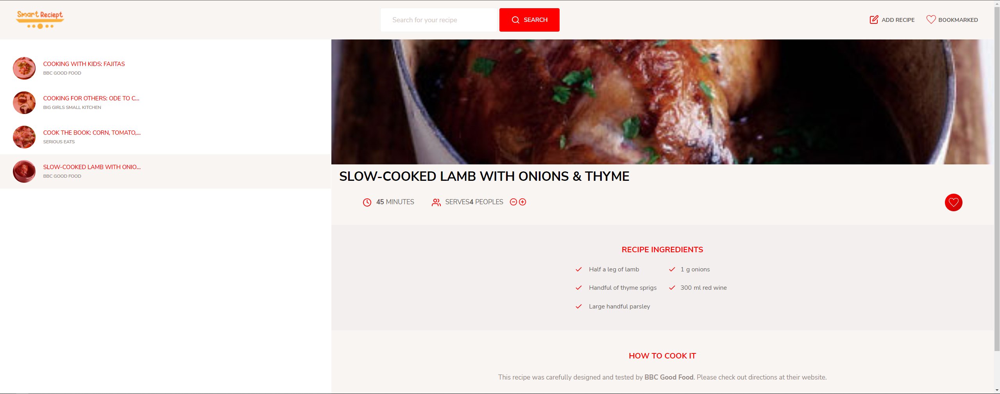

# SmartReciept

A site coded using forkify api, based on my work test.


### Preview :

<p align="center">
  
</p>

## how to use :

#### install :
``` npm install ```

#### run :

``` npx parcel serve ./index.html ```

#### infos :

<a href="https://forkify-api.herokuapp.com/">Api used</a>
<br />
<a href="https://www.udemy.com/course/the-complete-javascript-course/">Course based</a>
